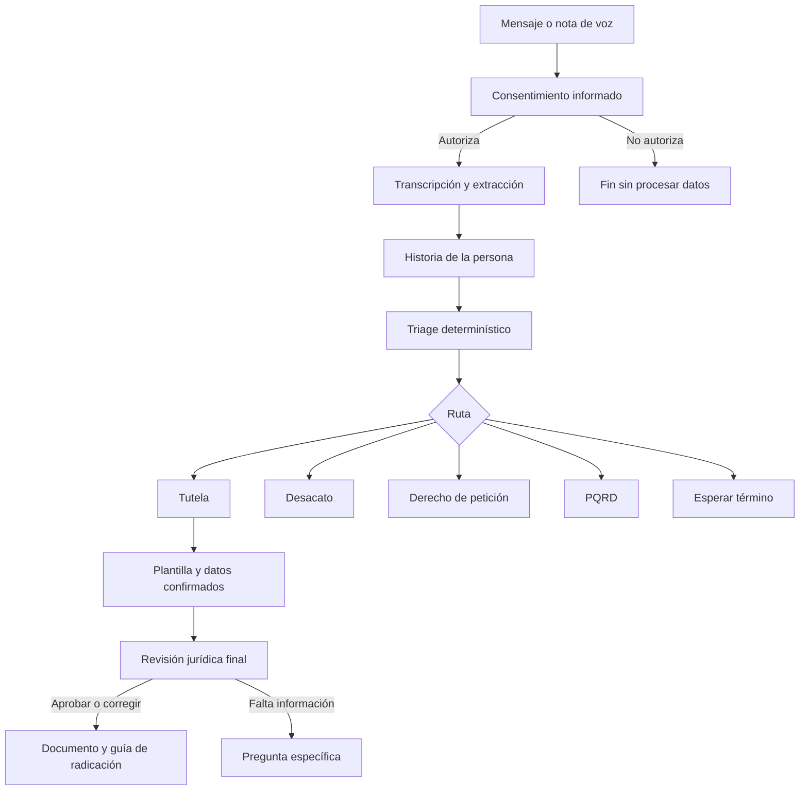

# Tutela Voz

> Orientación jurídica en salud, por voz y WhatsApp, para personas que no saben qué trámite deben iniciar ni cómo redactarlo.

Tutela Voz es un asistente conversacional que ayuda a las personas a ejercer sus derechos en salud en Colombia. Escucha su historia en lenguaje cotidiano, identifica la información relevante y las guía hacia la ruta adecuada: **acción de tutela**, **incidente de desacato**, **derecho de petición**, **PQRD** o espera del término legal.

La persona no necesita conocer conceptos jurídicos, llenar formularios complejos ni saber redactar un documento legal. Puede escribir o enviar notas de voz por WhatsApp.

## El problema

Una barrera de acceso a la justicia no siempre es la falta de un derecho. Muchas veces es no saber cómo ejercerlo.

Una persona puede necesitar un medicamento, una cita, un procedimiento o un tratamiento, pero no saber:

- si debe presentar primero una solicitud ante la EPS;
- si la urgencia de su situación permite acudir a tutela;
- si todavía debe esperar una respuesta;
- si corresponde presentar una PQRD;
- si el incumplimiento de un fallo debe tramitarse como desacato;
- qué pruebas necesita y dónde puede radicar el documento.

El lenguaje jurídico, los formularios, los plazos y la búsqueda de canales oficiales convierten un problema de salud en un recorrido difícil, especialmente para personas mayores, con discapacidad, con baja alfabetización digital o que atraviesan una situación médica urgente.

## La solución

Tutela Voz convierte una conversación sencilla en una ruta de acción comprensible.

1. Solicita autorización expresa para tratar datos personales y sensibles.
2. Recibe texto o notas de voz mediante WhatsApp y Kapso.
3. Transcribe el audio y extrae únicamente los datos sustentados en lo dicho por la persona.
4. Escucha primero la historia completa y después formula las preguntas necesarias.
5. Aplica un triage determinístico para seleccionar la ruta jurídica.
6. Solicita solamente los datos que hacen falta para esa ruta.
7. Genera el documento desde plantillas jurídicas preparadas.
8. Ejecuta una revisión final de coherencia, pruebas, procedencia, pretensiones y medida provisional.
9. Entrega el documento por WhatsApp y explica dónde y cómo puede radicarse.

## Triage jurídico

El triage es el núcleo de Tutela Voz. Su propósito no es sustituir a un abogado ni decidir si una persona “ganará”. Su función es ayudar a quien no sabe qué procedimiento debe seguir.

El sistema evalúa, en un orden definido, preguntas como estas:

- ¿Ya existía una tutela favorable que la EPS incumplió?
- ¿La persona solicitó previamente el servicio a la EPS?
- ¿La solicitud fue verbal o quedó radicada por escrito?
- ¿Existe riesgo para la vida o deterioro de la salud?
- ¿La persona es sujeto de especial protección constitucional?
- ¿El servicio se necesita con urgencia?
- ¿Ya venció el término de respuesta aplicable?

### Rutas posibles

| Situación identificada | Orientación del sistema |
| --- | --- |
| Existe un fallo de tutela favorable y la EPS no lo cumplió | Incidente de desacato |
| La persona aún no ha solicitado el servicio | Derecho de petición para crear una solicitud verificable |
| La solicitud fue verbal y no existe urgencia especial | Derecho de petición para obtener constancia y respuesta formal |
| Existe riesgo vital, urgencia o especial protección | Evaluación y preparación de acción de tutela |
| Hay petición escrita, el término venció y no existe urgencia constitucional | PQRD y canal correspondiente |
| Hay petición escrita, pero el término todavía está vigente | Explicación del plazo y recomendación de conservar la constancia |

Esta decisión se ejecuta mediante reglas de código verificables. El modelo de lenguaje no escoge libremente la ruta.

## Cómo funciona



## Seguridad jurídica

Tutela Voz separa las tareas probabilísticas de las decisiones que deben ser controlables.

### La IA puede

- transcribir una nota de voz;
- reconocer datos expresados por la persona;
- organizar el relato;
- detectar problemas de claridad y coherencia;
- revisar un borrador bajo una lista de reglas jurídicas;
- proponer correcciones que no alteren los hechos confirmados.

### La IA no puede

- escoger libremente la ruta jurídica;
- inventar hechos, pruebas, diagnósticos, fechas o radicados;
- modificar los datos confirmados por la persona;
- garantizar el resultado de una tutela;
- presentar una medida provisional como si fuera el fallo definitivo;
- enviar o radicar un documento sin autorización expresa.

Las reglas determinísticas tienen prioridad. Si el revisor detecta una contradicción o falta información indispensable, el documento se bloquea y no se entrega a medias.

## Revisión final de la tutela

Antes de entregar un documento, el agente de revisión aplica una lista verificable que cubre:

- claridad y lenguaje comprensible;
- hechos cronológicos y separados de los fundamentos jurídicos;
- relación entre cada hecho y sus pruebas;
- legitimación, inmediatez y subsidiariedad;
- identificación precisa de la barrera creada por la EPS;
- pretensiones concretas, ejecutables y dirigidas a la entidad correcta;
- tratamiento integral como pretensión independiente cuando corresponda;
- juramento sobre tutelas anteriores;
- medida provisional necesaria, temporal y proporcional;
- anexos, notificaciones y ausencia de datos inventados.

El resultado de la revisión puede ser **aprobar**, **corregir** o **bloquear**.

## Privacidad y consentimiento

La información de salud es un dato sensible. Por eso, la conversación jurídica no comienza hasta que la persona acepta el consentimiento informado mediante botones de respuesta rápida en WhatsApp.

El sistema:

- informa qué datos utilizará y para qué;
- permite autorizar o rechazar mediante botones;
- no descarga ni transcribe audios antes de la autorización;
- registra la fecha, el canal, la versión del aviso y el identificador del mensaje;
- conserva una constancia con el teléfono protegido mediante hash;
- permite solicitar consulta, corrección, eliminación o revocación;
- elimina la sesión después de 10 minutos de inactividad.

## Accesibilidad conversacional

Tutela Voz está diseñado para comunicarse con respeto y en lenguaje cotidiano.

- Responde tanto por escrito como por voz.
- No lee enlaces ni direcciones de correo electrónico en voz alta.
- Si no comprende una respuesta, pide repetirla una vez.
- En el segundo intento ofrece responder por escrito.
- Utiliza “correo electrónico” en lugar de “email”.
- Evita tecnicismos innecesarios y explica el siguiente paso.
- No repite preguntas que ya fueron respondidas.

## Canales y datos verificados

El sistema utiliza catálogos locales para:

- reconocer EPS y sus variantes de nombre;
- consultar canales oficiales de atención en salud;
- seleccionar juzgados y correos electrónicos disponibles por territorio;
- orientar la radicación cuando no existe un canal electrónico confirmado.

Si un dato no está verificado, Tutela Voz no lo inventa. En su lugar, explica una alternativa segura, como acudir a la personería municipal, la Defensoría del Pueblo o un juzgado.

## Arquitectura

```text
WhatsApp
   │
   ▼
Kapso ── webhook rápido ──► cola concurrente por teléfono
                                  │
                       ┌──────────┴──────────┐
                       ▼                     ▼
                 Voz / texto          Conversaciones en paralelo
                       │                     │
                       └──────────┬──────────┘
                                  ▼
                     extracción estructurada
                                  │
                                  ▼
                       triage determinístico
                                  │
                                  ▼
                  plantillas + revisión jurídica
                                  │
                                  ▼
                   documento + guía de radicación
```

Los teléfonos diferentes se procesan en paralelo. Los mensajes de una misma conversación conservan su orden. Esto evita que un audio largo bloquee la atención de otras personas.

## Estado actual

| Componente | Estado |
| --- | --- |
| Webhook de WhatsApp mediante Kapso | Implementado |
| Texto, notas de voz e indicador de escritura | Implementado |
| Botones de consentimiento informado | Implementado |
| Transcripción y extracción estructurada | Implementado |
| Triage determinístico | Implementado y probado |
| Conversaciones concurrentes por teléfono | Implementado |
| Catálogo de EPS y canales de salud | Implementado |
| Consulta territorial de juzgados | Implementado |
| Plantillas de tutela propia, de menor y con agente oficioso | Implementado |
| Revisión jurídica final | Implementado |
| Entrega de documento por WhatsApp | Implementado |
| Radicación automática en nombre de la persona | No habilitada; requiere consentimiento y una integración externa real |
| Corpus ampliado de tutelas favorables | En construcción |

## Alcance responsable

Tutela Voz facilita el acceso a información y documentos jurídicos, pero no sustituye la valoración de un abogado, una autoridad administrativa ni un juez. La persona debe revisar y firmar el documento antes de radicarlo.

El sistema no promete resultados. Su compromiso es más concreto: escuchar con respeto, identificar la ruta adecuada, no inventar información y entregar una orientación comprensible y verificable.
